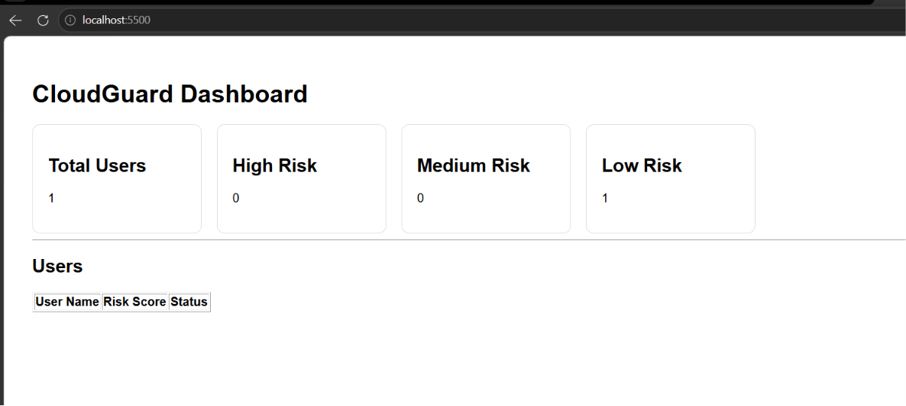

# CloudGuard

CloudGuard is a cloud security monitoring platform that analyzes AWS IAM users, evaluates security risks, and visualizes security metrics through a web dashboard.

## Features

* AWS IAM User Collection
* Permission Analysis
* Risk Scoring Engine
* Flask REST API
* Dashboard Visualization
* GitHub Version Control

## Technology Stack

* Python
* Flask
* AWS IAM
* HTML
* CSS
* JavaScript
* Git & GitHub

## Dashboard Preview

## API Endpoints

### Dashboard Data

GET /api/dashboard

### Dashboard Summary

GET /api/dashboard/summary

### Users

GET /api/users

## Future Enhancements

* Role Analysis
* MFA Detection
* Risk Charts
* PDF Reports
* Cloud Deployment

## Author

Priya Dharshini
